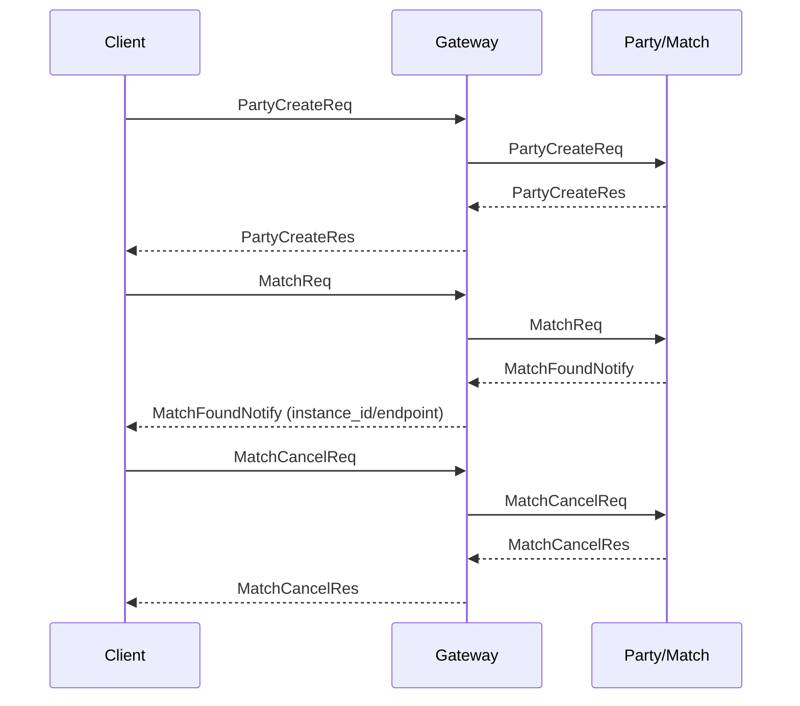
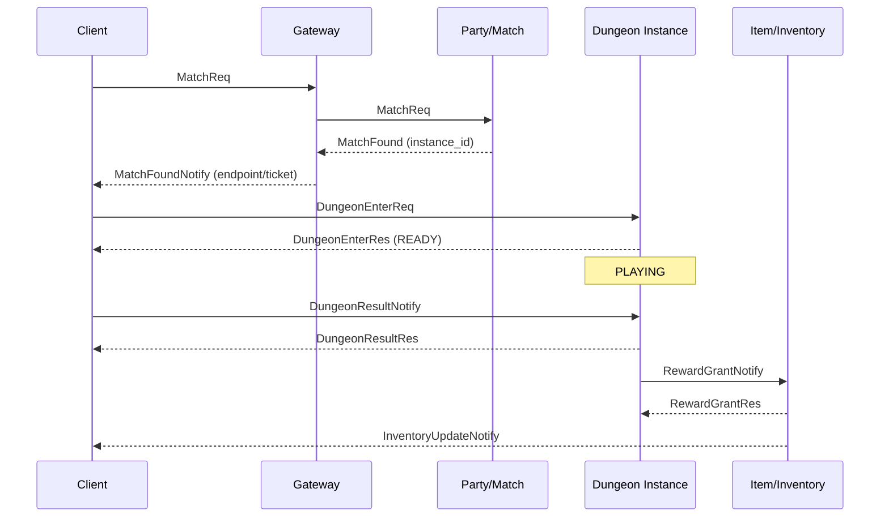

# DungeonHub Architecture (Draft)

## 1. 아키텍처 개요 (서비스 분리, 책임)
- **Gateway Server**
  - 인증/세션 유지, 클라이언트 연결 관리, 라우팅
  - heartbeat/timeout 처리, 재접속 토큰 검증
- **Party/Match Server**
  - 파티 생성/초대/수락/해체
  - 매칭 큐 관리, 던전 인스턴스 할당
- **Dungeon Instance Server**
  - 던전 룸 생성/삭제, 상태 머신 운영
  - 전투 이벤트 처리, 스케줄링
- **Item/Inventory Server**
  - 드랍/보상 지급, 인벤토리 업데이트
  - 트랜잭션 기반 원자적 처리
- **Guild/Chat Server**
  - 길드/채팅 채널 관리, 공지
- **Admin/GM API**
  - 강제 접속 종료, 던전 종료, 모니터링

## 1.1 네트워크 I/O 모델 및 스레딩
- **대상 플랫폼**
  - **Windows**: IOCP 기반 비동기 I/O (overlapped)
  - **Linux**: epoll 기반 이벤트 루프
- **스레딩 구조**
  - **Acceptor**: 리스닝 소켓 accept 전담. 신규 연결은 연결 ID/세션 초기화 후 이벤트 루프로 전달.
  - **Event Loop**: 소켓 read/write 이벤트를 수집하고 프레임 디코드/디스패치 파이프라인과 연결.
  - **Workers**: 패킷 처리(디코드 결과의 비즈니스 로직)를 전용 큐로 분리해 병렬 실행.
- **패킷 파이프라인**
  1. **Accept**: 연결 생성 → 세션 등록 → read 이벤트 등록
  2. **Read**: raw bytes 수신 → 프레임 디코더 → 패킷 큐에 enqueue
  3. **Dispatch**: 워커 스레드 풀에서 핸들러 실행 → 응답 프레임 생성
  4. **Write**: 응답 프레임을 소켓 write로 전달

## 2. 서버 Authoritative 검증 정책
- **이동(Movement)**: 클라이언트 위치/속도는 참고값으로만 사용하고, 서버가 마지막 승인 위치와 속도 한계를 기준으로 보정한다.
- **전투(Combat)**: 스킬 쿨타임/사거리/타겟 유효성은 서버 상태를 기준으로 검증하며, 클라이언트 판정은 신뢰하지 않는다.
- **보상(Reward)**: 보상 지급은 던전 상태 전이(CLEAR/FAIL)와 서버 계산 결과를 기준으로만 수행한다.
- **세션/권한**: 계정/세션 토큰은 모든 요청에 대해 서버에서 재검증하고, 권한이 부족한 요청은 즉시 거부한다.

## 3. 이상 징후 처리 흐름
1. **탐지**: 서명/HMAC 검증 실패, 비정상 seq/nonce, 과도한 이동 속도, 불가능한 데미지 등 규칙 위반 탐지.
2. **완화**: 요청 거부, 상태 롤백, 즉시 응답 차단(soft drop)으로 영향 최소화.
3. **기록**: 세션/계정 단위의 감사 로그와 메트릭을 기록하고, 자동 경보를 발생시킨다.
4. **제재**: 반복 위반 시 세션 종료, 임시 제한, 영구 정지까지 단계적으로 적용한다.
5. **분석**: 운영/보안 대시보드에서 패턴 분석 후 룰 업데이트와 재발 방지 정책을 반영한다.

## 4. 세션/매칭/던전 흐름 다이어그램

### 4.1 세션 라이프사이클
```mermaid
flowchart LR
    Client -->|LoginReq| Gateway
    Gateway -->|LoginRes(token)| Client
    Client -->|Heartbeat| Gateway
    Gateway -->|HeartbeatAck| Client
    Client -->|Disconnect| Gateway
    Client -->|SessionReconnectReq| Gateway
    Gateway -->|SessionReconnectRes| Client
```

### 4.2 매칭 플로우


### 4.3 던전 입장/종료 플로우


## 5. 상태 머신 정의
- **WAITING**: 인원 대기, 초대/수락 단계
- **READY**: 전투 시작 준비, 타임아웃/준비 확인
- **PLAYING**: 전투 진행, 이벤트/데미지/아이템 처리
- **CLEAR**: 목표 달성, 보상 처리
- **FAIL**: 실패 처리, 보상/패널티 처리
- **TERMINATE**: 세션 종료, 리소스 정리

전이 규칙 요약:
- `WAITING -> READY`: 파티 인원 충족 + 입장 승인
- `READY -> PLAYING`: 준비 완료 시그널 수신
- `PLAYING -> CLEAR/FAIL`: 던전 목표 달성 또는 실패 조건
- `CLEAR/FAIL -> TERMINATE`: 보상 지급 및 인벤토리 반영 완료

## 6. 주요 데이터 모델
- **users**: `id`, `account`, `last_login`, `status`
- **characters**: `id`, `user_id`, `job`, `level`, `power`
- **inventory**: `char_id`, `item_id`, `count`
- **party**: `party_id`, `leader_id`, `state`, `created_at`
- **party_members**: `party_id`, `char_id`, `role`, `joined_at`
- **dungeon_instances**: `instance_id`, `party_id`, `state`, `created_at`, `ended_at`
- **match_history**: `match_id`, `instance_id`, `char_id`, `result`, `time`
- **guilds**: `guild_id`, `name`, `leader_id`
- **guild_members**: `guild_id`, `char_id`, `role`

### 6.1 인덱싱/쿼리 예시
- **inventory** 복합 인덱스
  ```sql
  CREATE INDEX idx_inventory_char_item
    ON inventory (char_id, item_id);
  ```
  - 캐릭터 기준 인벤토리 조회 및 아이템 단건 조회를 모두 커버
- **match_history** 조회 최적화
  ```sql
  CREATE INDEX idx_match_history_char_time
    ON match_history (char_id, time DESC);
  ```
  ```sql
  SELECT match_id, instance_id, result, time
    FROM match_history
   WHERE char_id = ?
   ORDER BY time DESC
   LIMIT 20;
  ```
  - 캐릭터별 최근 매치 기록 조회에 최적화

## 7. 프로토콜 요약
- **LoginReq/LoginRes**: 토큰 발급 및 세션 생성
- **PartyCreateReq/PartyInviteReq/PartyJoinRes**: 파티 생성 및 초대
- **MatchReq/MatchFoundNotify**: 매칭 요청 및 인스턴스 할당/입장 티켓 수신
- **DungeonEnterReq/DungeonEnterRes**: 던전 입장 요청/응답
- **DungeonEvent**: 스킬/데미지/이벤트 전송
- **DungeonResultNotify/DungeonResultRes**: 클리어/실패 결과 통보
- **RewardGrantNotify/RewardGrantRes**: 보상 지급 처리(서버 내부)
- **InventoryUpdateNotify/InventoryUpdateRes**: 보상/아이템 반영
- **AdminKickReq/AdminRoomCloseReq**: 운영툴 API

> 상세 스펙은 `docs/protocol.md`를 참고한다.
