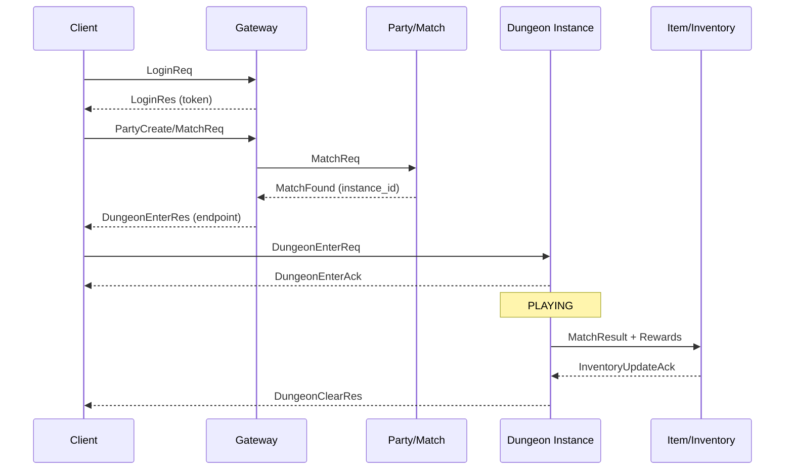

# DungeonHub Architecture (Draft)

## 1. 아키텍처 개요 (서비스 분리, 책임)
- **Gateway Server**
  - 인증/세션 유지, 클라이언트 연결 관리, 라우팅
  - heartbeat/timeout 처리, 재접속 토큰 검증
- **Party/Match Server**
  - 파티 생성/초대/수락/해체
  - 매칭 큐 관리, 던전 인스턴스 할당
- **Dungeon Instance Server**
  - 던전 룸 생성/삭제, 상태 머신 운영
  - 전투 이벤트 처리, 스케줄링
- **Item/Inventory Server**
  - 드랍/보상 지급, 인벤토리 업데이트
  - 트랜잭션 기반 원자적 처리
- **Guild/Chat Server**
  - 길드/채팅 채널 관리, 공지
- **Admin/GM API**
  - 강제 접속 종료, 던전 종료, 모니터링

## 2. 핵심 흐름(던전 입장/종료) 시퀀스 다이어그램

## 3. 상태 머신 정의
- **WAITING**: 인원 대기, 초대/수락 단계
- **READY**: 전투 시작 준비, 타임아웃/준비 확인
- **PLAYING**: 전투 진행, 이벤트/데미지/아이템 처리
- **CLEAR**: 목표 달성, 보상 처리
- **FAIL**: 실패 처리, 보상/패널티 처리
- **TERMINATE**: 세션 종료, 리소스 정리

전이 규칙 요약:
- `WAITING -> READY`: 파티 인원 충족 + 입장 승인
- `READY -> PLAYING`: 준비 완료 시그널 수신
- `PLAYING -> CLEAR/FAIL`: 던전 목표 달성 또는 실패 조건
- `CLEAR/FAIL -> TERMINATE`: 보상/정산 완료

## 4. 주요 데이터 모델
- **users**: `id`, `account`, `last_login`, `status`
- **characters**: `id`, `user_id`, `job`, `level`, `power`
- **inventory**: `char_id`, `item_id`, `count`
- **party**: `party_id`, `leader_id`, `state`, `created_at`
- **party_members**: `party_id`, `char_id`, `role`, `joined_at`
- **dungeon_instances**: `instance_id`, `party_id`, `state`, `created_at`, `ended_at`
- **match_history**: `match_id`, `instance_id`, `char_id`, `result`, `time`
- **guilds**: `guild_id`, `name`, `leader_id`
- **guild_members**: `guild_id`, `char_id`, `role`

## 5. 프로토콜 요약
- **LoginReq/LoginRes**: 토큰 발급 및 세션 생성
- **PartyCreateReq/PartyInviteReq/PartyJoinRes**: 파티 생성 및 초대
- **MatchReq/MatchFoundRes**: 매칭 요청 및 인스턴스 할당
- **DungeonEnterReq/DungeonEnterRes**: 던전 입장 요청/응답
- **DungeonEvent**: 스킬/데미지/이벤트 전송
- **DungeonClearRes/DungeonFailRes**: 종료 결과 통보
- **InventoryUpdateNotify**: 보상/아이템 반영
- **AdminKickReq/AdminRoomCloseReq**: 운영툴 API
